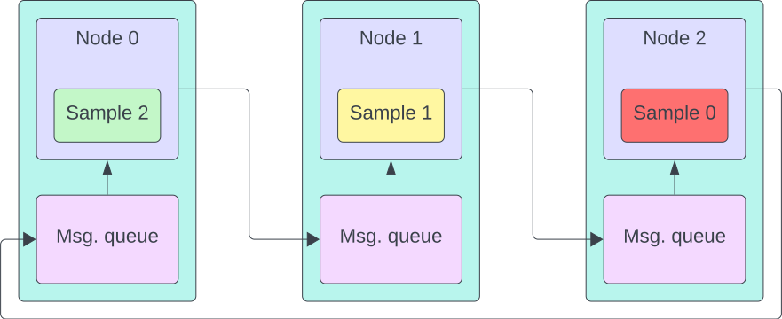

# MDI-LLM

> Implementation of Model-Distributed Inference for Large Language Models

**Note:** this repository is Work-In-Progress! Some information may be inaccurate or missing.

---

This repository contains the implementation of Model-Distributed Inference for [nanoGPT](https://github.com/karpathy/nanoGPT) and [GPT2](https://huggingface.co/openai-community/gpt2).
The idea behind this approach for generation is to partition the model among different nodes, by assigning, for example, some layers to each, and perform inference by transmitting over TCP/IP the intermediate results of the model to the next one, who will use them as inputs for its own model chunk, forming a communication chain between the devices.

The system architecture is the following:
This can not only solve memory limitations of resource-limited devices, but also result in lower inference times when paired with _recurrent pipelining_.

Recurrent pipelining is a technique introduced in this scenario to prevent idle nodes in the network during inference.
Given the autoregressive nature of a decoder-only transformer model, where the generated output is appended to the inputs and fed back again to the model to evaluate the next output token, if generating a single piece of text, this would result in idle nodes when waiting for the next iteration result.\
To solve this issue, the rationale is to generate at least as many pieces of text (_samples_) as the number of nodes in the network.
Each node will then process one different sample after the other, in a loop, and then pass the result of its local piece of model to the next one.
This way, at each step, it is possible to make each of the nodes process a different sample, without having to wait for the same sample to be fed back for the next iteration.

> 
> Message transmission with _recurrent pipelining_

The network is actually a closed loop, as the outputs of the last node in the chain are then transmitted back to the starter node.

## Testbed

The contents of this repository were developed to run over a network of 3 Nvidia Jetson TX2's (8 GB of shared memory) running JetPack 4.6.4, connected via gigabit ethernet.
These systems only support up to Python 3.8 and Torch (with CUDA support) <= 1.12 (due to their latest CUDA version being v10.2), but this specific version needs to be compiled from source to work.
See [docs/setup-tx2.md](docs/setup-tx2.md) for how to prepare the testing environment (software side).

## Models overview

- NanoGPT: <https://github.com/karpathy/nanoGPT>
  - Starting point for the development of this system
  - In this case, nanoGPT refers to "toy" models using a restricted number of transformer layers (7, 9, or 12), a low embedding dimension (384 or 768), a short context length (128 to 1024 tokens), and 6 attention heads per transformer layer.
  - The tokenizers used are: character-level tokenizer (one char/token, vocabulary size: 65), simple BPE tokenizer trained on the input text itself (variable number of tokens, used 500, 1000, 2000, 10000).
- GPT-2: the implementation includes elements from both the above repository and Huggingface's "Transformers" library.

  - This implementation supports all GPT-2 flavors: "standard", medium, large, and XL.
    The specifics for each model are:
    | Flavor | N. layers | Embedding dim. | N. attention heads | N. parameters |
    |-------------|-----------|----------------|--------------------|---|
    | gpt2 | 12 | 768 | 12 | 124 M |
    | gpt2-medium | 24 | 1024 | 16 | 350 M |
    | gpt2-large | 36 | 1280 | 20 | 774 M |
    | gpt2-xl | 48 | 1600 | 25 | 1.56 B |

    While the common parameters are:

    - Context length: 1024 tokens
    - Vocabulary size: 50257 (GPT2 tokenizer, from `tiktoken` library).

## Implementation details

Note: the number of total transformer layers in the model changes depending on the specific model (and "flavor") used.
These layers are then partitioned in order to assign few of them to the starter node, and the same amount to the other nodes, in an attempt to balance the amount of computation done by each device.

> 
> Layers assignment (GPT-2)

- Two node types:
  1. **Starter node**: it is the node that "controls" the network, meaning it starts generation and collects the outputs.
     This node contains the following layers: token embedding, positional embedding, some transformer layers, plus the final normalization layer and linear layer (producing the output distribution over the tokens space);
     This partition was selected to allow each node of the chain to transmit (and receive) the same amount of data - having the last node transmit the output distribution to the starter node would have resulted in a larger amount of data being transmitted.
  2. **Secondary node**: it contains transformer layers only.
- The transmitted messages between the different nodes contain the intermediate results of the network, meaning they are Torch tensors of size: $(\text{embedding dimension}) \times (\text{current context length})$, where the "_embedding dimension_" is the length of the vectors with which each transformer works, and the "_current context length_" is the minimum between the number of generated tokens and the context length of the models, i.e., the attention "window" size.
  - The time effectiveness of Model-Distributed Inference is strictly related to the ability of the network to transmit the messages quickly enough to prevent overhead.

> 
> Application architecture

## Performance analysis

Time vs. number of generated tokens, GPT-2 Large, sample size of 400 tokens:

_Note:_ in order to use pipelining, the 3-node scenario has to produce (at least) 3 samples; as a result, the plot for 3 nodes has been cropped to 800 generated tokens (equivalent to 2 samples), but it would have been longer.

Time vs. number of tokens, GPT-2 XL; because of the model size and memory constraints of the Nvidia Jetson TX2 boards, the only way to run the model is to split it in at least 3 chunks.

---

## License

Copyright 2024 Davide Macario (@davmacario)

Licensed under the Apache License, Version 2.0 (the "License");
you may not use this file except in compliance with the License.
You may obtain a copy of the License at

    http://www.apache.org/licenses/LICENSE-2.0

Unless required by applicable law or agreed to in writing, software
distributed under the License is distributed on an "AS IS" BASIS,
WITHOUT WARRANTIES OR CONDITIONS OF ANY KIND, either express or implied.
See the License for the specific language governing permissions and
limitations under the License.
