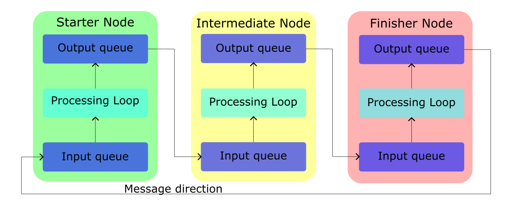
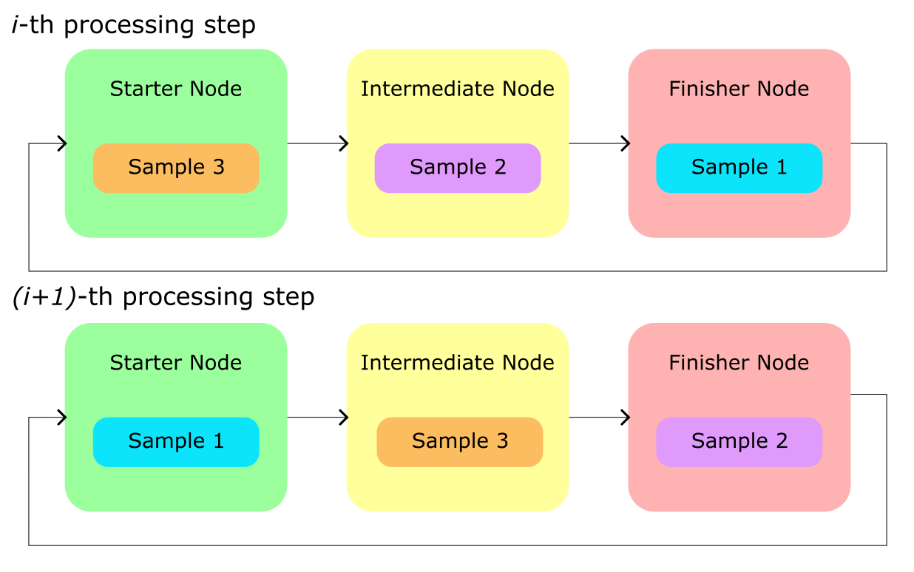
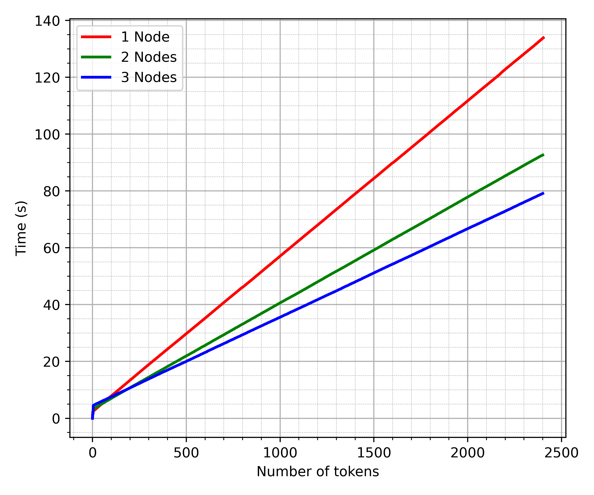
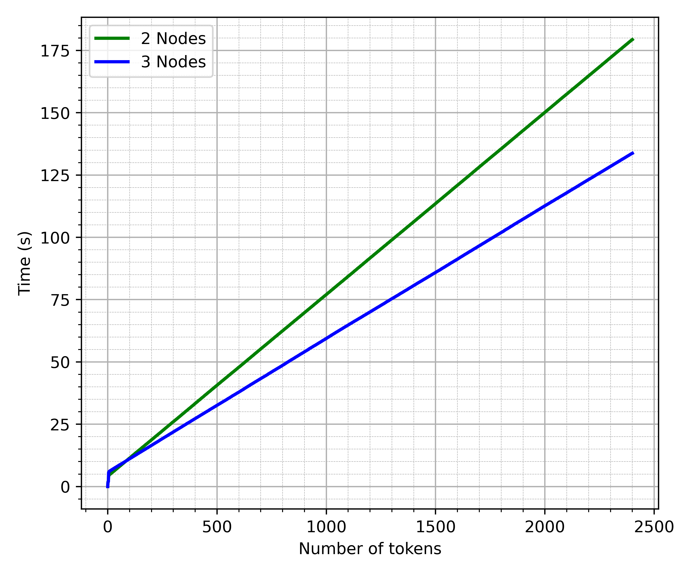

# MDI-LLM


Code for "A Model-Distributed Inference Approach for Large Language Models at
the Edge" -- M.S. Thesis (Summer 2024)

> Implementation of Model-Distributed Inference for Large Language Models,
> allowing to deploy state-of-the-art LLM families on a network of edge devices.

---

This repository contains the implementation of Model-Distributed Inference for
the [litGPT](https://github.com/Lightning-AI/litgpt) framework.

The approach is to create "nodes" (software entities) running on the different
network devices, and which get assigned a portion of the model layers.
Inference will then be carried out by transmitting the intermediate activation
vectors of the model between different nodes.

This approach was designed to allow large models to run over multiple devices
with limited capabilities.

With no changes to the code, it is possible to run the "nodes" on the same
computer, allowing for distributing inference efforts over multiple GPUs on the
same system or even static offloading of the parameters in the RAM.

The advantage of this framework is the implementation of "recurrent" pipeline
parallelism, which is a technique introduced to improve the efficiency of the
system when dealing with at least as many samples (i.e., processed pieces of
text) as the number of nodes by avoiding idle nodes at all times and achieve
parallel processing.

This repository contains the entire work that started with implementing MDI for
NanoGPT, followed by the porting of the GPT-2 architecture (see [old](./old)),
leading to the final version, which consists of the implementation of
[litGPT](https://github.com/Lightning-AI/litgpt), specifically for the Llama
architecture.

This repository also contains the code for training/finetuning and running
single-device inference of LitGPT models (and all possible variants obtained by
handpicking the configuration parameters), providing a simplified implementation
compared to the original one.

## Quickstart

### Llama over 3 devices

To run Llama 3 on a network of 3 devices, follow these steps.

Having cloned this repository and installed the [requirements](requirements.txt)
on each host device, modify or create your own configuration file using as a
reference the [existing ones](src/llama/settings_distributed/configuration.json).
Make sure the devices can "see" each other over the network.\
**Note:** the program will use the GPU by default, if available, but it is
possible to specify a different torch device as a command line argument.
It is also possible to select the device for each node through the
configuration file (JSON) by adding the `"device"` key to the node information.\
**Note (2):** the data type used will be bfloat16 when available, else float16,
but can be overridden from the command line (`--dtype`).

First, download the model and convert it to the litGPT format (note: to access
the weights, it is required to accept the license agreement on HF and provide
your personal access token to the `prepare_model.py` script):

```bash
./src/prepare_model.py meta-llama/Meta-Llama-3-8B-Instruct --n-nodes 3 --hf-token "<your huggingface token>"
```

On the starter node, run:

```bash
./src/starter.py --ckpt ./src/checkpoints/meta-llama/Meta-Llama-3-8B-Instruct -v --nodes-config ./src/settings-distr/config.json --n-samples 3 --n-tokens 500 --prompt "Who are you?" --block-size 500
```

This will make the node partition the model in chunks, and send them to the other
nodes at initialization; in general, it is preferred to partition and send the
model beforehand.

On the first worker node, run:

```bash
./src/secondary.py -v --nodes-config ./src/settings-distr/config.json 0
```

On the second worker node, run:

```bash
./src/secondary.py -v --nodes-config ./src/settings-distr/config.json 1
```

**Note:** the above commands assume that the configuration JSON file is the same
on all the devices.
The `--nodes-config` flag requires two arguments in secondary nodes: the
configuration file and the positional index of the node configuration parameters
in the "secondary" list of the JSON file.

```json
{
  "addr": "10.7.48.12",
  "communication": {
    "starter_addr": "10.7.48.46",
    "port": 8089
  },
  "inference": {
    "port_in": 5090,
    "port_out": 5091
  },
  "device": "cuda"
}
```

The file above will work as long as the same address and ports are specified on
the main configuration file passed to the starter node.

### Llama 3 on multi-GPU system

To run Llama 3 over 2 GPUs of the same system, instead, just run the
[src/llama/starter.py](src/llama/starter.py) and
[src/llama/secondary.py](src/llama/secondary.py) programs on the same host, using
the following as node configuration file (see
[src/llama/settings_distr/config_2gpus.json](src/llama/settings_distr/config_2gpus.json)),
or just specify different devices when launching the program from the CLI
(`--device` flag):

```json
{
  "nodes": {
    "starter": {
      "addr": "127.0.0.1",
      "communication": {
        "port": 8088
      },
      "inference": {
        "port_in": 5088,
        "port_out": 5089
      },
      "device": "cuda:0"
    },
    "secondary": [
      {
        "addr": "127.0.0.1",
        "communication": {
          "starter_addr": "127.0.0.1",
          "port": 8090
        },
        "inference": {
          "port_in": 5092,
          "port_out": 5093
        },
        "device": "cuda:1"
      }
    ]
  }
}
```

First, prepare the model (splitting the 2 chunks) -- if the model was already
downloaded, you should not need the Huggingface token:

```bash
./src/prepare_model.py meta-llama/Meta-Llama-3-8B-Instruct --n-nodes 2 --hf-token "<your huggingface token>"
```

Starter node:

```bash
./src/starter.py --ckpt ./src/checkpoints/meta-llama/Meta-Llama-3-8B-Instruct -v --nodes-config ./src/settings-distr/config_2gpus.json --n-samples 2 --n-tokens 500 --prompt "What is the recipe for pizza?" --block-size 500
```

Worker node:

```bash
./src/llama2/secondary.py -v --chunk ./src/llama/checkpoints/meta-llama/Meta-Llama-3-8B-Instruct/chunks/2nodes/model_secondary0.pth --nodes-config src/settings_distr/config_2gpus.json 0
```

## Rationale

The idea behind this approach for generation is to partition the model among
different nodes by assigning a piece of the model to each and perform inference
by transmitting over TCP/IP the intermediate results of the model to the next
one, who will use them as inputs for its own model chunk, forming a
communication chain between the devices.

This can solve the memory limitations of resource-limited devices and also
result in lower inference times when paired with _"recurrent" pipeline parallelism_.

Recurrent pipeline parallelism is a technique introduced to prevent idle nodes
in the network during inference.
Given the autoregressive nature of a decoder-only transformer model, where the
generated output is appended to the inputs and fed back to the model input to
evaluate the next output token if generating a single piece of text, this would
result in idle nodes when waiting for the current forward pass to finish.\
To solve this issue, the rationale is to generate at least as many pieces of
text (_samples_) as the number of nodes in the network.
Each node will then process one different sample after the other, in a loop, and
then pass the result of its local piece of model to the next one.
This way, at each step, it is possible to make each of the nodes process a
different sample, without having to wait for the same sample to be fed back for
the next iteration.

Message transmission is handled through input and output queues to provide a
buffer whenever the processing time for each node is not exactly the same for
all.
Indeed, while it is necessary to ensure no device acts as the bottleneck for
the generation speed by choosing the most suitable model partition scheme, it
is not possible to avoid slight changes in transmission delays due to
unpredictable network conditions.

> <center> with pipelining" width="600"/>
>
> Message transmission </center>

> <center> with pipelining" width="600"/>
>
> _Recurrent pipeline parallelism_</center>

The network is actually a closed loop, as the outputs of the last node in the
chain are then transmitted back to the starter node.

Another important aspect of distributed inference in LLMs is that of the
transmitted message size.\
In NanoGPT and GPT-2, the intermediate activations have a size that increases as
more tokens are generated until the context is full.
Since both models have a relatively low embedding dimension (i.e., length of
each vector associated to a token), despite the messages growing in size, it is
still possible to achieve fast generation as the overall amount of transmitted
data is still low.\
Moving to Llama, which is a state-of-the-art model and uses a bigger embedding
dimension, it wouldn't be possible to transmit the intermediate activations fast
enough to ensure efficient generation.
We overcome this issue by pairing recurrent pipeline parallelism with rotating
KV caches.
This means that each node will keep separate KV caches for all the samples that
are generated, and when it processes a sample it uses the corresponding cache to
evaluate the output.
Thanks to KV caching, it is now only required to forward the one embedding
associated with the new token in the sequence at each generation iteration,
allowing for much smaller message size and reduced transmission time.

## Architecture

The system architecture is the following:

<center></center>

The starter node acts as the main node (even though it is not a "central server"
as in federated scenarios).\
First, it initializes each worker node by sending an HTTP POST request with the
configuration information and, optionally, the model chunk.
Then, the network will set up the communication channel for inference,
implemented using Python `sockets` over TCP/IP.
This reduces the communication overhead to a minimum, while still ensuring
reliable transmission.\
The application layer protocol is a simple "header + payload", where the header
only contains the exact size of the payload.

At the end of the generation, the starter node (which is the only one tracking
the number of generated samples and tokens) will send out a stopping message
over the socket, signalling the end of generation.
Upon receiving this message, each node will interrupt the generation loop and
stop the queues.
Then, then starter node will send a PUT request to each node, which will make
them stop all threads and shut down.

_Note_: this approach (stopping message over sockets + PUT request) was selected
to allow nodes to stay idle after a generation run and await for further
instructions, possibly including other runs to start.
This feature has not been implemented yet.

## Testbed

The contents of this repository were developed to run over a network of 3 Nvidia
Jetson TX2's (8 GB of shared memory) running JetPack 4.6.4, connected via
gigabit ethernet.
These systems only support up to Python 3.8 and Torch (with CUDA support) <=
1.12 (due to their latest CUDA version being v10.2), but this specific version
needs to be compiled from source to work.\
See [docs/setup-tx2.md](docs/setup-tx2.md) for how to prepare the testing
environment (software side).

The multi-GPU case has been tested on a workstation using 2x Nvidia GTX 1080 Ti
(11 GB VRAM each).

## Models overview

- NanoGPT: <https://github.com/karpathy/nanoGPT>
  - Starting point for the development of this system
  - In this case, nanoGPT refers to "toy" models using a restricted number of
    transformer layers (7, 9, or 12), a low embedding dimension (384 or 768), a
    short context length (128 to 1024 tokens), and 6 attention heads per
    transformer layer.
  - The tokenizers used are: character-level tokenizer (one char/token,
    vocabulary size: 65), simple BPE tokenizer trained on the input text itself
    (variable number of tokens, used 500, 1000, 2000, 10000).
- GPT-2: the implementation includes elements from both the above repository and
  Huggingface's "Transformers" library.

  - This implementation supports all GPT-2 flavors: "standard", medium, large,
    and XL.
    The specifics for each model are:
    | Flavor | N. layers | Embedding dim. | N. attention heads | N. parameters |
    |-------------|-----------|----------------|--------------------|---|
    | gpt2 | 12 | 768 | 12 | 124 M |
    | gpt2-medium | 24 | 1024 | 16 | 350 M |
    | gpt2-large | 36 | 1280 | 20 | 774 M |
    | gpt2-xl | 48 | 1600 | 25 | 1.56 B |

    While the common parameters are:

    - Context length: 1024 tokens
    - Vocabulary size: 50257 (GPT2 tokenizer, from `tiktoken` library).

- Llama architecture (NanoLlama, TinyLlama, Llama 2, [Llama 3]) - based on the
  [litgpt](https://github.com/Lightning-AI/litgpt) implementation.
  - Specs:
    | Model | N. layers | Embedding dim. | N. attention heads | N. parameters | Context Len. | Vocab. size |
    |-------|-----------|----------------|--------------------|---------------|-------------|--------------|
    | NanoLlama | 12 | 1024 | 16 | 304 M | 2048 | 32000 |
    | TinyLlama | 22 | 2048 | 32 | 1.1 B | 2048 | 32000 |
    | Llama 2 | 32 | 4096 | 32 | 7 B | 4096 | 32000 |
    | Llama 3 | 32 | 4096 | 32 | 8B | 8192 | 128000 |

## Implementation details

Note: the number of total transformer layers in the model changes depending on
the specific model (and "flavor") used.
These layers are then partitioned in order to assign few of them to the starter
node and the same amount to the other nodes, in an attempt to balance the amount
of computation done by each device.\
To ensure transmission of the same amount of data between the devices, the last
layer is assigned to the starter node, that will use it on the tensor
transmitted by the last worker node of the network, before extracting the next
token.

> <center>  width="400"/>
>
> Layers assignment (GPT-2)</center>

- Two node types:
  1. **Starter node**: it is the node that "controls" the network, meaning it
     starts generation and collects the outputs.
     This node contains the following layers: token embedding, positional
     embedding, some transformer layers, plus the final normalization layer and
     linear layer (producing the output distribution over the tokens space);
     This partition was selected to allow each node of the chain to transmit
     (and receive) the same amount of data - having the last node transmit the
     output distribution to the starter node would have resulted in a larger amount
     of data being transmitted.
  2. **Secondary node**: it contains transformer layers only.
- The transmitted messages between the different nodes contain the intermediate
  results of the network, meaning they are Torch tensors of size:
  $(\text{embedding dimension}) \times (\text{current context length})$, where the
  "_embedding dimension_" is the length of the vectors with which each transformer
  works, and the "_current context length_" is the minimum between the number of
  generated tokens and the context length of the models, i.e., the attention
  "window" size.
  - The time effectiveness of Model-Distributed Inference is strictly related to
    the ability of the network to transmit the messages quickly enough to prevent
    overhead.
  - The generation of very long samples slows down because of both slow layer
    processing in each node and increased message size. Notice, however, that the
    message size increases until the maximum context length is reached.

## Performance analysis

Time vs. number of generated tokens, GPT-2 Large, sample size of 400 tokens:

<center></center>

_Note:_ in order to use pipelining, the 3-node scenario has to produce (at
least) 3 samples; as a result, the plot for 3 nodes has been cropped to 800
generated tokens (equivalent to 2 samples), but it would have been longer.

Time vs. number of tokens, GPT-2 XL; because of the model size and memory
constraints of the Nvidia Jetson TX2 boards, the only way to run the model is to
split it in at least 3 chunks.

<center></center>

---

Time vs. number of tokens, NanoLlama 304M.
This toy model is based on the Llama 2 architecture and it can run on a single
Nvidia Jetson.

<center></center>

Time vs. number of tokens, TinyLlama 1.1B; notice how the introduction of KV
caching brought significant speedup compared to GPT-2 XL (of similar size).

<center></center>

---

## License

MIT

## Cite

Bibtex:

```bibtex
@software{Macario_A_Model-Distributed_Inference_2024,
  author = {Macario, Davide},
  month = apr,
  title = {{A Model-Distributed Inference Approach for Large Language Models at the Edge}},
  version = {1.0.0},
  year = {2024}
}
```
