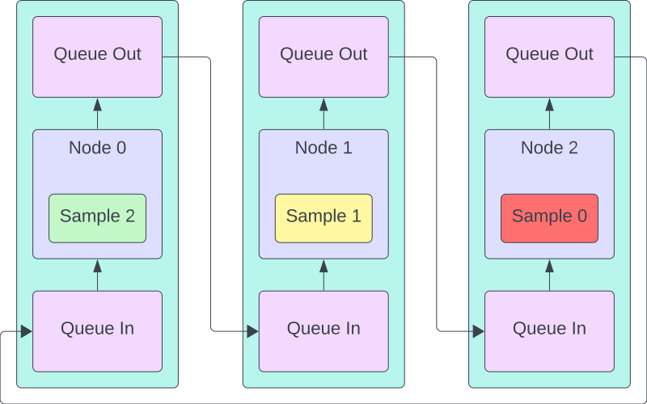
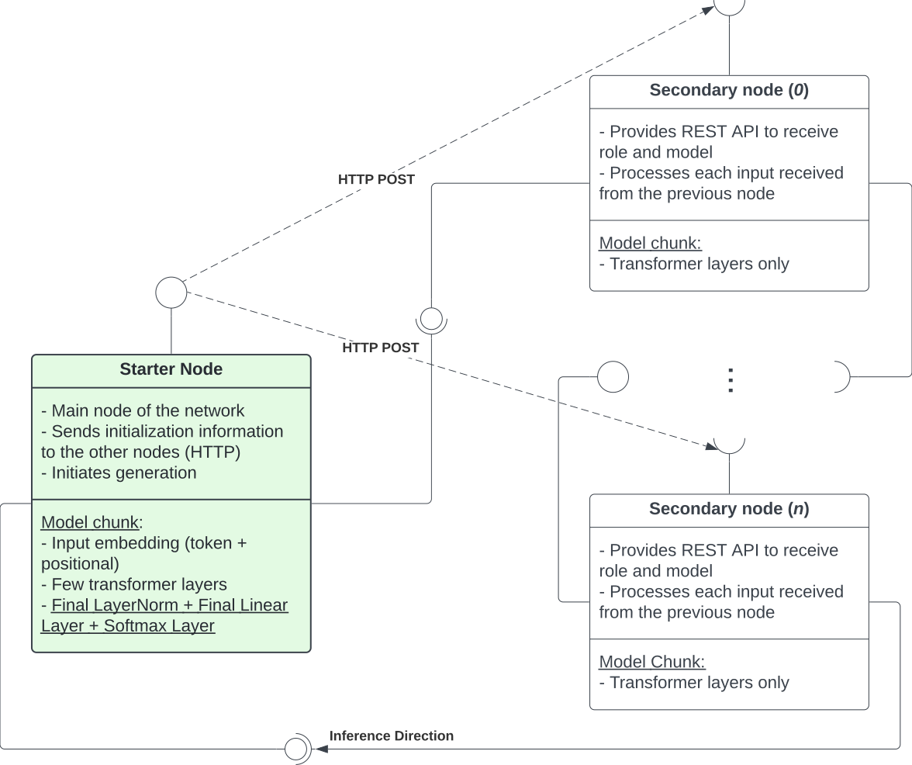
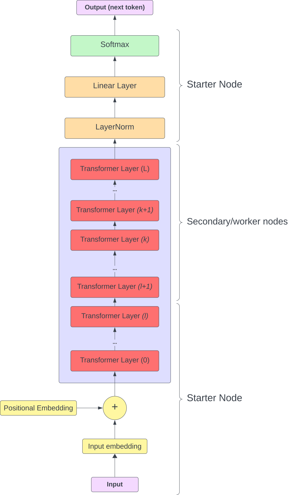
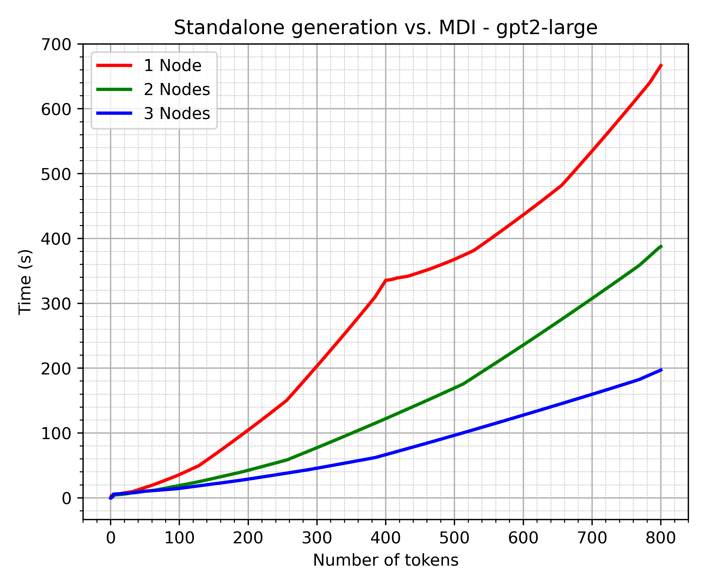
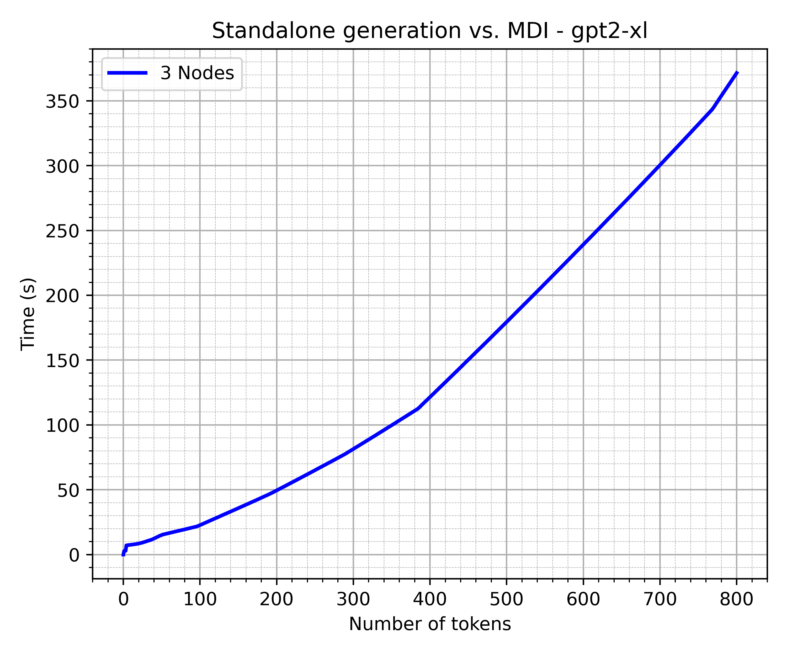

# MDI-LLM

Code for "A Model-Distributed Inference Approach for Large Language Models at the Edge"

---

> Implementation of Model-Distributed Inference for Large Language Models


**Note:** this repository is a work in progress! Some information may be inaccurate or missing.

---

This repository contains the implementation of Model-Distributed Inference for [nanoGPT](https://github.com/karpathy/nanoGPT) and [GPT2](https://huggingface.co/openai-community/gpt2).

This framework allows to run these 2 LLMs over a network of computers ("_nodes_").
With no changes to the code, it is also possible to run the "nodes" on the same computer, allowing for distributing inference efforts over multiple GPUs on the same system.

This approach was designed to allow large models to run over multiple devices with limited VRAM.

This framework also allows for pipelining the inference process to minimize the idle time of each node.
Pipelining achieves a good performance in terms of generation time when the number of _samples_ (i.e., independent output pieces of text of the LLM) is at least as great as the number of nodes, as it allows the nodes to always be processing a different sample at all times.

Notice that since the work found on this repository started with the distributed implementation of NanoGPT, the code used for distributing that model is "outdated" (see [nanoGPT folder](src/nanoGPT)).
The contents of [src/GPT2](src/GPT2), instead, contain the final version of MDI for GPT-2.

This repository also contains the code for training/finetuning and running single-device inference of GPT-2 models (and all possible variants obtained by handpicking the configuration parameters) based on the NanoGPT code (with minor adaptations).
The code supports Torch's Data-Distributed Parallelism (`DistributedDataParallel`), but I plan to add model-parallelism training following something like [this](https://pytorch.org/tutorials/intermediate/model_parallel_tutorial.html) or supporting [PyTorch's PiPPy](https://github.com/pytorch/PiPPy).

## Quickstart

### GPT-2 over 3 devices

To run GPT-2 on a network of 3 devices, follow these steps.

Having cloned this repository and installed the [requirements](requirements.txt) on each host device, modify or create your own configuration file using as a reference the [existing ones](src/GPT2/settings_distributed/configuration.json).
Make sure the devices can "see" each other over the network.\
**Note**: the program will use the GPU by default, if available.
To select a specific device, edit the file [src/GPT2/sub/config.py](src/GPT2/sub/config.py), assigning a different value to `DEVICE`.
It is also possible to specify the device for each node through the configuration file (JSON): just add the `"device"` key to the node information.

On the starter node, run:

```bash
./src/GPT2/starter.py -v --model gpt2 --n-samples 3 --n-tokens 200 --nodes-config src/GPT2/settings_distr/configuration.json --prompt "Here is the recipe for pizza"
```

On the first worker node, run:

```bash
./src/GPT2/secondary.py -v --n-samples 3 --n-tokens 200 --nodes-config src/GPT2/settings_distr/configuration.json 0
```

On the second worker node, run:

```bash
./src/GPT2/secondary.py -v --n-samples 3 --n-tokens 200 --nodes-config src/GPT2/settings_distr/configuration.json 1
```

**Note:** the above commands assume that the configuration JSON file is the same on all the devices.
The `--nodes-config` flag requires two arguments: the configuration file and the positional index of the node configuration parameters in the "secondary" list of the JSON file.
Using the `--secondary-config` flag, it is possible to specify a JSON file containing the node configuration only as:

```json
{
  "addr": "10.7.48.12",
  "communication": {
    "starter_addr": "10.7.48.46",
    "port": 8089
  },
  "inference": {
    "port_in": 5090,
    "port_out": 5091
  },
  "device": "cuda"
}
```

The file above will work as long as the same address and ports are specified on the main configuration file passed to the starter node.

### GPT-2 XL on multi-GPU system

To run GPT-2 XL over 2 GPUs of the same system, instead, just run the [src/GPT2/starter.py](src/GPT2/starter.py) and [src/GPT2/secondary.py](src/GPT2/secondary.py) programs on the same host, using the following as node configuration file (see [src/GPT2/settings_distr/config_2gpus.json](src/GPT2/settings_distr/config_2gpus.json)):

```json
{
  "nodes": {
    "starter": {
      "addr": "127.0.0.1",
      "communication": {
        "port": 8088
      },
      "inference": {
        "port_in": 5088,
        "port_out": 5089
      },
      "device": "cuda:0"
    },
    "secondary": [
      {
        "addr": "127.0.0.1",
        "communication": {
          "starter_addr": "127.0.0.1",
          "port": 8090
        },
        "inference": {
          "port_in": 5092,
          "port_out": 5093
        },
        "device": "cuda:1"
      }
    ]
  }
}
```

Starter node:

```bash
./src/GPT2/starter.py -v --model gpt2-xl --n-samples 2 --n-tokens 200 --nodes-config src/GPT2/settings_distr/config_2gpus.json --prompt "Here is the recipe for pizza"
```

Worker node:

```bash
./src/GPT2/secondary.py -v --n-samples 2 --n-tokens 200 --nodes-config src/GPT2/settings_distr/config_2gpus.json 0
```

## Rationale

The idea behind this approach for generation is to partition the model among different nodes by assigning a piece of the model to each and perform inference by transmitting over TCP/IP the intermediate results of the model to the next one, who will use them as inputs for its own model chunk, forming a communication chain between the devices.

This can solve the memory limitations of resource-limited devices and also result in lower inference times when paired with _recurrent pipelining_.

Recurrent pipelining is a technique introduced in this scenario to prevent idle nodes in the network during inference.
Given the autoregressive nature of a decoder-only transformer model, where the generated output is appended to the inputs and fed back to the model input to evaluate the next output token if generating a single piece of text, this would result in idle nodes when waiting for the current forward pass to finish.\
To solve this issue, the rationale is to generate at least as many pieces of text (_samples_) as the number of nodes in the network.
Each node will then process one different sample after the other, in a loop, and then pass the result of its local piece of model to the next one.
This way, at each step, it is possible to make each of the nodes process a different sample, without having to wait for the same sample to be fed back for the next iteration.

> <center>
>
> Message transmission with _recurrent pipelining_</center>

The network is actually a closed loop, as the outputs of the last node in the chain are then transmitted back to the starter node.

## Architecture

The system architecture is the following:

<center></center>

The starter node acts as the main node (even though it is not a "central server" as in federated scenarios).\
First, it initializes each worker node by sending an HTTP POST request with the configuration information and, optionally, the model chunk.
Then, the network will set up the communication channel for inference, implemented using Python `sockets` over TCP/IP.
This reduces the communication overhead to a minimum, while still ensuring reliable transmission.\
The application layer protocol is a simple "header + payload", where the header only contains the exact size of the payload.

At the end of the generation, the starter node (which is the only one tracking the number of generated samples and tokens) will send out a stopping message over the socket, signalling the end of generation.
Upon receiving this message, each node will interrupt the generation loop and stop the queues.
Then, then starter node will send a PUT request to each node, which will make them stop all threads and shut down.

_Note_: this approach (stopping message over sockets + PUT request) was selected to allow nodes to stay idle after a generation run and await for further instructions, possibly including other runs to start.
This feature has not been implemented yet.

## Testbed

The contents of this repository were developed to run over a network of 3 Nvidia Jetson TX2's (8 GB of shared memory) running JetPack 4.6.4, connected via gigabit ethernet.
These systems only support up to Python 3.8 and Torch (with CUDA support) <= 1.12 (due to their latest CUDA version being v10.2), but this specific version needs to be compiled from source to work.\
See [docs/setup-tx2.md](docs/setup-tx2.md) for how to prepare the testing environment (software side).

The multi-GPU case has been tested on a workstation using 2x Nvidia GTX 1080 Ti (11 GB VRAM each).

## Models overview

- NanoGPT: <https://github.com/karpathy/nanoGPT>
  - Starting point for the development of this system
  - In this case, nanoGPT refers to "toy" models using a restricted number of transformer layers (7, 9, or 12), a low embedding dimension (384 or 768), a short context length (128 to 1024 tokens), and 6 attention heads per transformer layer.
  - The tokenizers used are: character-level tokenizer (one char/token, vocabulary size: 65), simple BPE tokenizer trained on the input text itself (variable number of tokens, used 500, 1000, 2000, 10000).
- GPT-2: the implementation includes elements from both the above repository and Huggingface's "Transformers" library.

  - This implementation supports all GPT-2 flavors: "standard", medium, large, and XL.
    The specifics for each model are:
    | Flavor | N. layers | Embedding dim. | N. attention heads | N. parameters |
    |-------------|-----------|----------------|--------------------|---|
    | gpt2 | 12 | 768 | 12 | 124 M |
    | gpt2-medium | 24 | 1024 | 16 | 350 M |
    | gpt2-large | 36 | 1280 | 20 | 774 M |
    | gpt2-xl | 48 | 1600 | 25 | 1.56 B |

    While the common parameters are:

    - Context length: 1024 tokens
    - Vocabulary size: 50257 (GPT2 tokenizer, from `tiktoken` library).

## Implementation details

Note: the number of total transformer layers in the model changes depending on the specific model (and "flavor") used.
These layers are then partitioned in order to assign few of them to the starter node and the same amount to the other nodes, in an attempt to balance the amount of computation done by each device.\
To ensure transmission of the same amount of data between the devices, the last layer is assigned to the starter node, that will use it on the tensor transmitted by the last worker node of the network, before extracting the next token.

> <center> 
>
> Layers assignment (GPT-2)</center>

- Two node types:
  1. **Starter node**: it is the node that "controls" the network, meaning it starts generation and collects the outputs.
     This node contains the following layers: token embedding, positional embedding, some transformer layers, plus the final normalization layer and linear layer (producing the output distribution over the tokens space);
     This partition was selected to allow each node of the chain to transmit (and receive) the same amount of data - having the last node transmit the output distribution to the starter node would have resulted in a larger amount of data being transmitted.
  2. **Secondary node**: it contains transformer layers only.
- The transmitted messages between the different nodes contain the intermediate results of the network, meaning they are Torch tensors of size: $(\text{embedding dimension}) \times (\text{current context length})$, where the "_embedding dimension_" is the length of the vectors with which each transformer works, and the "_current context length_" is the minimum between the number of generated tokens and the context length of the models, i.e., the attention "window" size.
  - The time effectiveness of Model-Distributed Inference is strictly related to the ability of the network to transmit the messages quickly enough to prevent overhead.
  - The generation of very long samples slows down because of both slow layer processing in each node and increased message size. Notice, however, that the message size increases until the maximum context length is reached.

## Performance analysis

Time vs. number of generated tokens, GPT-2 Large, sample size of 400 tokens:

<center></center>

_Note:_ in order to use pipelining, the 3-node scenario has to produce (at least) 3 samples; as a result, the plot for 3 nodes has been cropped to 800 generated tokens (equivalent to 2 samples), but it would have been longer.

Time vs. number of tokens, GPT-2 XL; because of the model size and memory constraints of the Nvidia Jetson TX2 boards, the only way to run the model is to split it in at least 3 chunks.

<center></center>

---

## License

Copyright 2024 Davide Macario (@davmacario)

Licensed under the Apache License, Version 2.0 (the "License");
you may not use this file except in compliance with the License.
You may obtain a copy of the License at

    http://www.apache.org/licenses/LICENSE-2.0

Unless required by applicable law or agreed to in writing, software
distributed under the License is distributed on an "AS IS" BASIS,
WITHOUT WARRANTIES OR CONDITIONS OF ANY KIND, either express or implied.
See the License for the specific language governing permissions and
limitations under the License.
